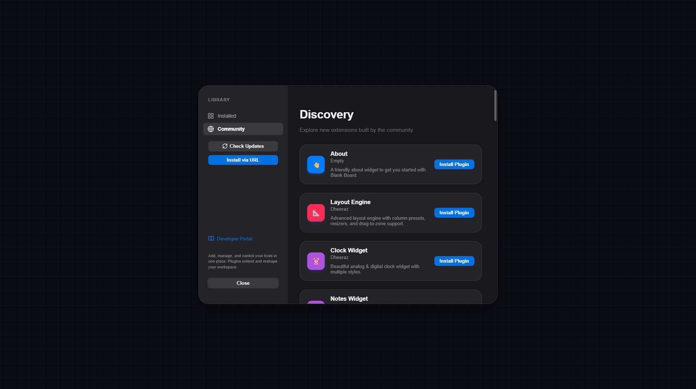
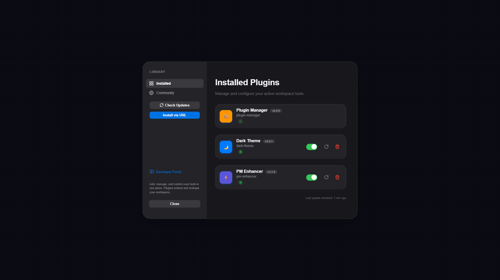

# 🧩 Empty Plugins

> A community-driven plugin registry for **Empty**. Drop in a JSON file, share your plugins, extend your board.

[](https://emptyweb.netlify.app/)
[](https://empty-ad9a3406.mintlify.app/)
[](#license)

<p align="center">
  
  
</p>

---

## About

**Empty Plugins** is a centralized registry that makes it easy to discover, install, and share plugins for **Empty***. Instead of hunting across repos and threads, point your app at one URL and get access to the entire community plugin catalog.

## 📦 Available Plugins

| ID | Name | Author |
|----|------|--------|
| `hello` | Hello Box | Your Name |
| `notes` | Sticky Notes | Community |

## 🚀 Getting Started

### 1. Install a Plugin

Open **Empty** and navigate to **Settings → Plugins**, then paste the registry URL: https://raw.githubusercontent.com/dheeraz101/Empty_Plugins/main/plugins.json

Browse the catalog and install with one click.

### 2. Build Your Own

Check out the **[Documentation](https://empty-ad9a3406.mintlify.app/)** for a full guide on:

- Plugin architecture & lifecycle hooks
- Available APIs and UI components
- Best practices and common patterns
- Debugging and testing your plugin locally

## ➕ Submit Your Plugin

Want to share your plugin? Open a Pull Request!

1. **Fork** this repo
2. **Edit** `plugins.json` — add your entry:

   ```json
   {
     "id": "your-plugin-id",
     "name": "Your Plugin Name",
     "url": "https://raw.githubusercontent.com/your-username/your-repo/main/plugin.js",
     "author": "Your Name"
   }